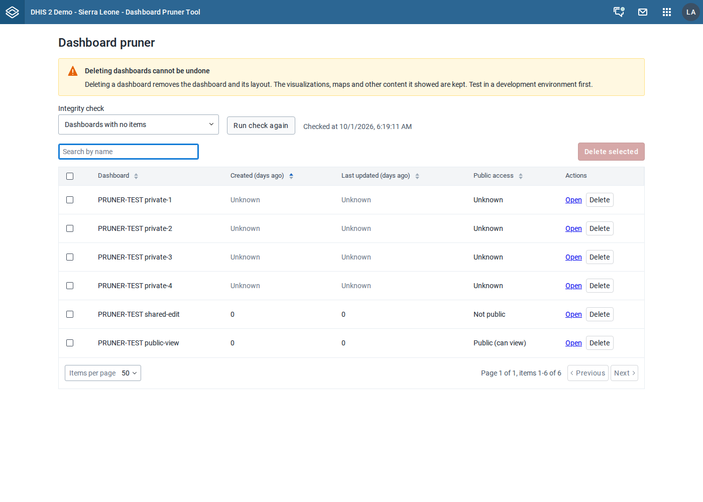
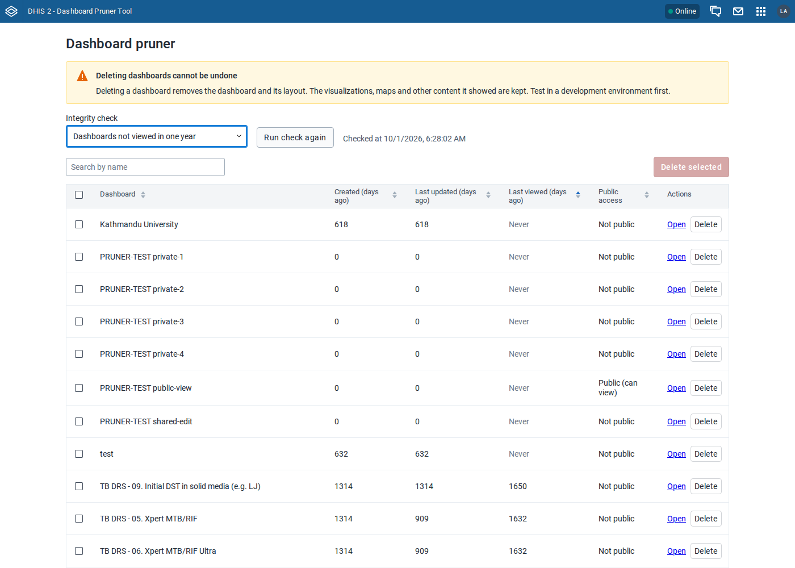
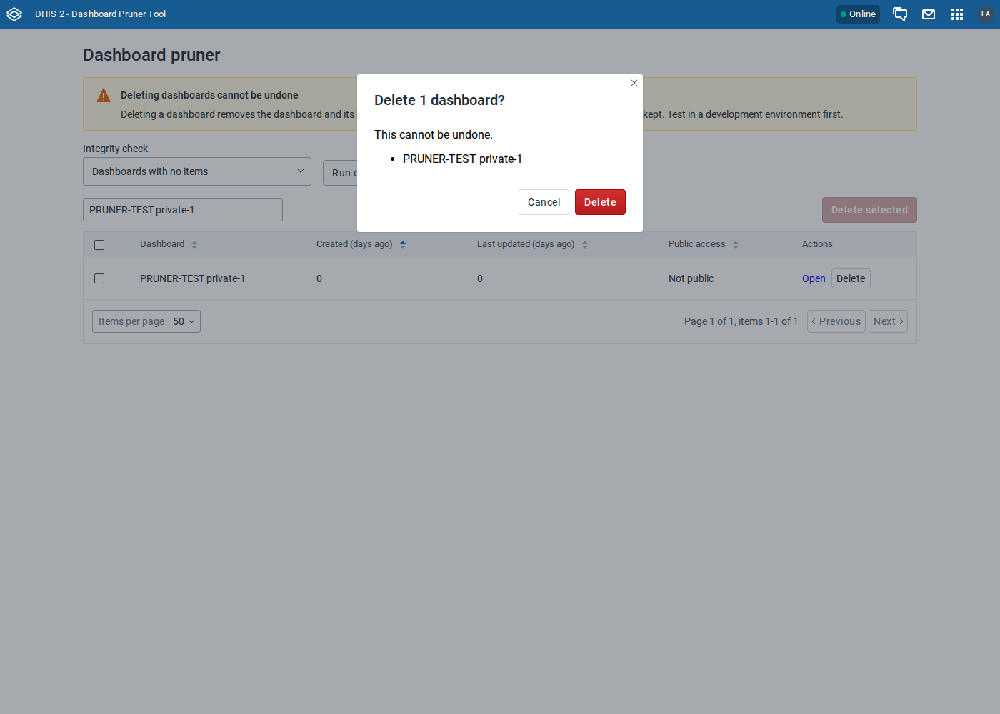
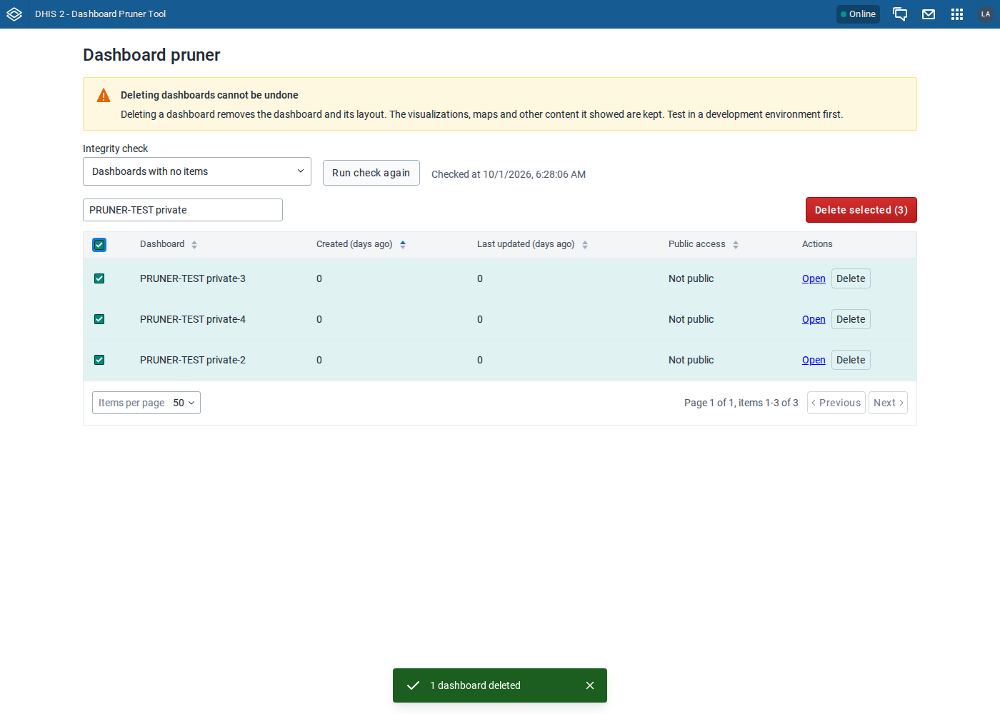
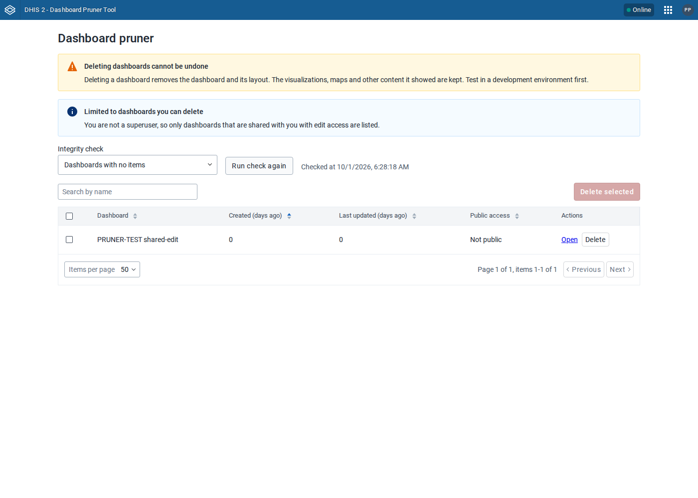
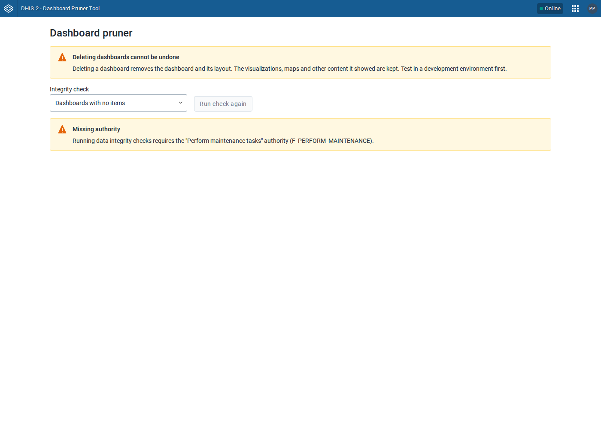

# UI test results: Dashboard Pruner Tool v0.2.0 (App Platform)

Tested: 2026-10-01 · Mode: production zip installed on each instance (`build/bundle/Dashboard-Pruner-Tool-0.2.0.zip`),
plus one extra run against the dev server (`d2-app-scripts start --proxy`) on 2.42 ·
Suite: `e2e/seed.py` + `e2e/test_pruner.py` (Playwright, Chromium headless)

Test data: the demo databases below, plus the fixtures from `e2e/seed.py`: six empty `PRUNER-TEST …` dashboards.
Four are private, owned by a non-superuser and shared with no one. One is shared with `pruner_tester` with edit
access, and one is public with view access. The seed also creates the users `pruner_tester` (has
`F_PERFORM_MAINTENANCE`) and `pruner_viewer` (does not). The superuser is `local_admin`.

## Instances

| Label    | DHIS2 version | Database seed                      |
| -------- | ------------- | ---------------------------------- |
| 2.40 SL  | 2.40.12       | `dhis2-db-sierra-leone_V40.sql.gz` |
| 2.41 Lao | 2.41.10       | `lao_hmis_demo_v41.sql.gz`         |
| 2.42 SL  | 2.42.6        | `dhis2-db-sierra-leone_v42.sql.gz` |
| 2.43 Lao | 2.43.1        | `lao_hmis_demo_v43.sql.gz`         |

All were disposable test instances, created for this review and removed afterwards.

## Results

Each version ran the suite on the final build or an earlier one (see the note below the table). The suite has 10 flows and exits with a failure
on any unexpected console, page or HTTP error.

| Flow                          | 2.40 SL   | 2.41 Lao   | 2.42 SL   | 2.43 Lao              | What is asserted                                                                                       |
| ----------------------------- | --------- | ---------- | --------- | --------------------- | ------------------------------------------------------------------------------------------------------ |
| Install over legacy 0.1.9     | —         | —          | PASS      | —                     | The same app key upgrades it in place, giving one app at version 0.2.0                                 |
| Default check (no items)      | PASS (6)  | PASS (7)   | PASS (6)  | PASS (7)              | The table total equals a fresh server-side run of `dashboards_no_items`                                |
| Not viewed in one year        | PASS (33) | PASS (174) | PASS (33) | PASS (174)            | The total equals the API result. Lao spans 4 pages. On ≤2.41 most rows come from by-id lookups         |
| Search + public-access labels | PASS      | PASS       | PASS      | PASS                  | Search narrows the table to the 4 private rows. A view-only public dashboard shows "Public (can view)" |
| Open link                     | PASS      | PASS       | PASS      | PASS                  | Returns 200. On 2.43 it lands on `/apps/dashboard#/<id>`                                               |
| Single delete                 | PASS*     | PASS*      | PASS      | PASS                  | The API returns 404, the row stays gone after the rerun, and **the search is kept**                    |
| Bulk delete                   | PASS      | PASS       | PASS      | PASS                  | Select-all picks only the filtered rows, and a selection hidden by a search change is cleared          |
| Delete, then switch check     | PASS      | PASS       | PASS      | PASS                  | The other check's cached result does not show the deleted dashboard                                    |
| Push analysis blocks delete   | PASS      | PASS       | PASS      | n/a (removed in 2.43) | Row shows the push analysis name, and its checkbox and Delete button are disabled                      |
| Non-superuser                 | PASS      | PASS       | PASS      | PASS                  | Only the 1 dashboard the user can delete is listed                                                     |
| No `F_PERFORM_MAINTENANCE`    | PASS      | PASS       | PASS      | PASS                  | A warning is shown and no `POST dataIntegrity` is sent                                                 |

2.40, 2.41 and 2.42 ran the final build (10 flows each). 2.43 ran an earlier build, from before fixes #19
and #20 in FIXES.md. Neither fix changes behaviour on 2.43: no dashboards are looked up by id there, and the
push-analysis query is turned off because the feature no longer exists.

### Permission behaviour (API probes)

|                                                                     | 2.40.12                   | 2.41.10             | 2.42.6           | 2.43.1              |
| ------------------------------------------------------------------- | ------------------------- | ------------------- | ---------------- | ------------------- |
| Superuser, GET by id of another user's unshared private dashboard   | 200, full access          | 200, full access    | 200, full access | 200, full access    |
| Superuser, `/api/dashboards` list complete?                         | **No** (sharing-filtered) | **No** (3 of 198)   | Yes (28 of 28)   | Yes (194 of 194)    |
| Non-owner user without a share, GET or DELETE by id                 | —                         | —                   | 404 / 404        | —                   |
| `POST dataIntegrity/details` with / without `F_PERFORM_MAINTENANCE` | 200 / blocked in UI       | 200 / blocked in UI | 200 / 403        | 200 / blocked in UI |

## Version-specific failures

None. Two differences between versions did not affect the app:

- The install endpoint returns `204` on 2.40 and 2.41, and `201` on 2.42 and 2.43.
- On 2.42 and 2.43 the app runs inside the global-shell iframe. The suite finds it via `page.frames`.

## Console/network hygiene

The app itself logged no console errors, page errors or 4xx/5xx responses on any version. The only noise came
from the platform:

- On 2.42 and 2.43, the global shell logs "This window is not a secure context — PWA features will not work".
  This happens because the test instances are served over plain HTTP on a non-localhost host.
- In dev mode, the header bar requests `/api/42/staticContent/logo_banner` and gets a 404, because the
  instance has no custom logo.
- `@dhis2/app-runtime` logs a deprecation warning for `paging=false` on the dashboards query. The app needs every
  dashboard's metadata to match against the check's result, so it keeps `paging=false`.

## Legacy 0.1.9 comparison (installed on the same instances)

| Behaviour                                                             | 0.1.9 (webpack)                                           | 0.2.0 (App Platform)           |
| --------------------------------------------------------------------- | --------------------------------------------------------- | ------------------------------ |
| Delete one dashboard, then the list refreshes                         | **The deleted dashboard is still listed** (2.42 SL, live) | The row is gone (all versions) |
| A dashboard named ``, created by a non-superuser | **Script runs in the admin's session** (2.43 Lao, live)   | The name is shown as text      |

## Screenshots

